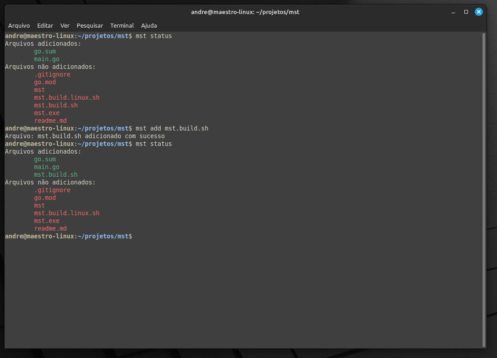

# MST 

O MST é uma ferramenta simples escrita em Go para iniciar e explorar comandos em um terminal personalizado.

## Instalação

Certifique-se de ter o Go instalado em seu sistema. Você pode instalar o MST usando o seguinte comando:

```bash
go get github.com/AndreCordeir0/mst
```

## Adicionando ao PATH
Para facilitar o uso do MST em qualquer diretório do terminal, você pode adicionar o diretório do executável MST à variável de ambiente PATH. Aqui estão algumas instruções básicas para diferentes sistemas operacionais:

## No Linux/Mac:
Abra o arquivo de perfil (como .bashrc ou .zshrc):

```bash
nano ~/.bashrc
Adicione a seguinte linha no final do arquivo, substituindo /caminho/para/mst pelo caminho real para o diretório do executável MST:
```

export PATH=$PATH:/caminho/para/mst
Salve e feche o arquivo. Depois, execute o seguinte comando para aplicar as alterações:

```bash
source ~/.bashrc
```

## No Windows:
    Adicione o diretório do executável MST ao PATH usando o Painel de Controle:  
    Abra o Painel de Controle.  
    Vá para "Sistema e Segurança" -> "Sistema".  
    Clique em "Configurações avançadas do sistema" no painel esquerdo.  
    Clique em "Variáveis de Ambiente...".  
    Em "Variáveis do Sistema", selecione a variável "Path" e clique em "Editar...".  
    Clique em "Novo" e adicione o caminho para o diretório do executável MST.  
    Lembre-se de reiniciar o terminal ou abrir um novo terminal para que as alterações entrem em vigor.  

## Uso
Após a instalação, você pode usar o MST no terminal:

```bash
mst help
```

e ver todos os comandos disponiveis :)


